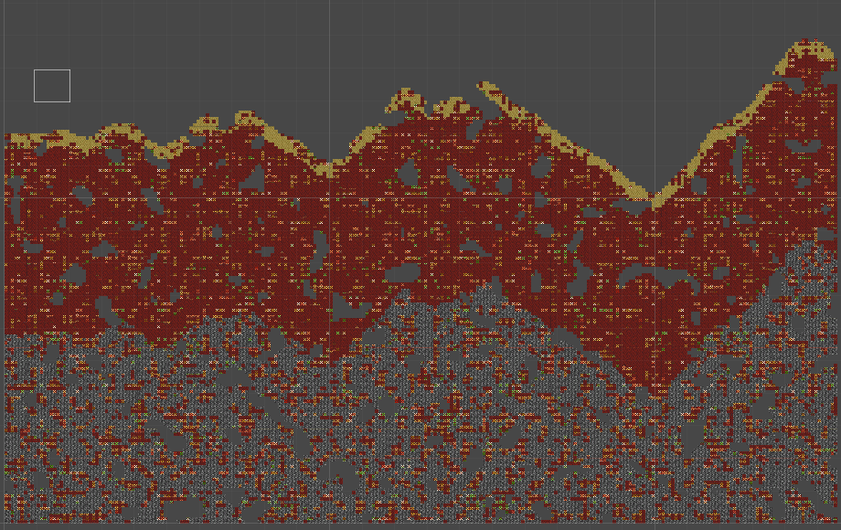
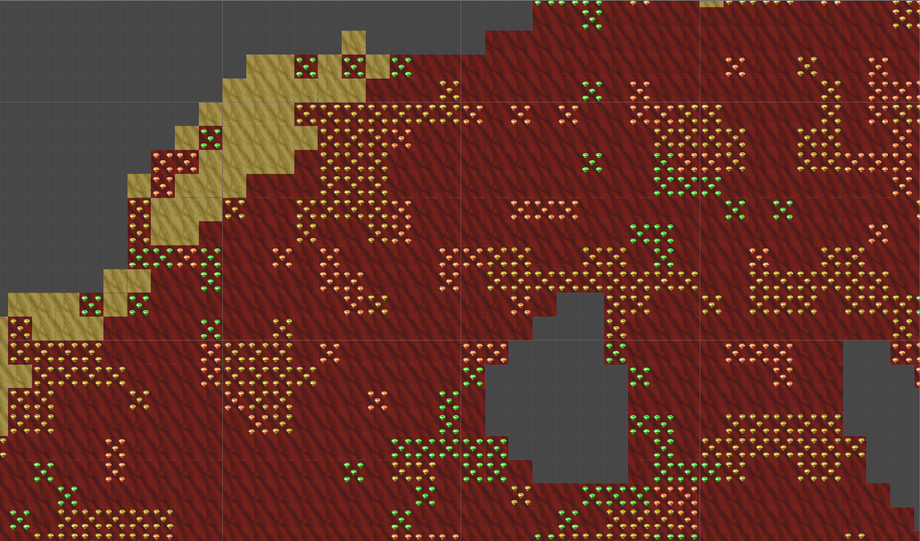
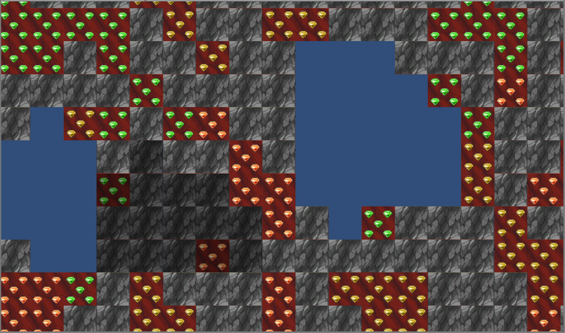
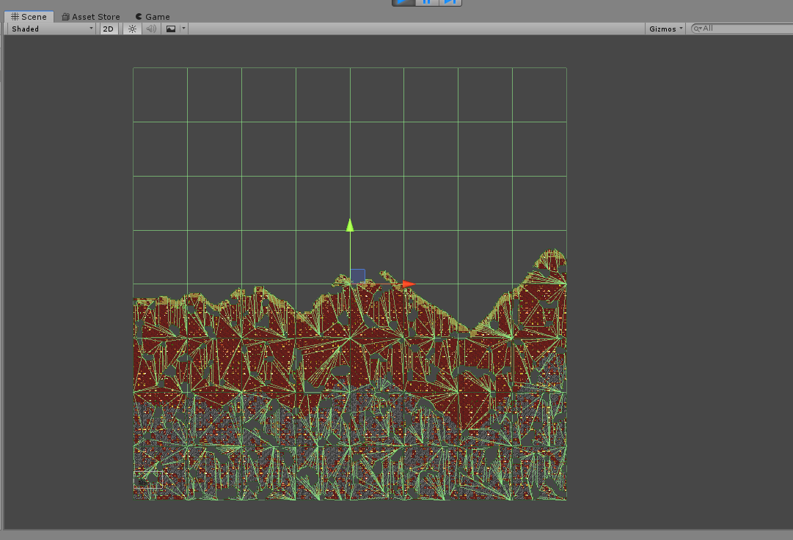

# 2DTerrainGen

This repository contain asset for random generation 2d terrain

<table style="width: 100%;">
	<tbody>
		<tr>
			<td>  </td>
			<td>  </td>
			<td>  </td>
		</tr>
		<tr>
			<td> </td>
			<td>  </td>
			<td> </td>
		</tr>
	</tbody>
</table>

<b>Main features</b> 
<ul>
  <li>Easy terrain generation based on multiple Perlin noise layers</li>
  <li>Two layers terrain style (like terraria etc.)</li>
  <li>Compatible with Tilemap features</li>
  <li>User friendly interface</li>	
</ul> 

<dl>
  <dt>Unity version</dt>
  <dd>Package has been submitted using <b>Unity 2018.3</b></dd>
</dl>
